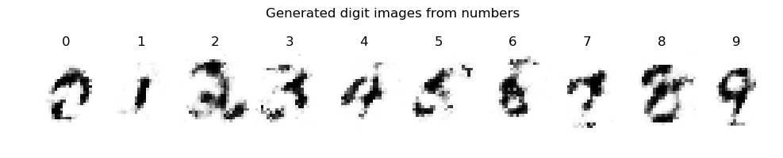

## Simple tutotial code for Restricted Boltzmann Machines (RBM)

The python code implements RBM with an example of MNIST digits image reconstruction.

It also includes a classifier with the vanilla RBM, i.e., the visible units include not only the input but also the labels. Then the RBM learns the distribution of p(v, label, h). The classification is to find the distribution of p(label|v). With the simple implementation, the classifier achieved 92% accuracy without tuning, if trained with 100 epochs.

The classifier code comes with a naive generator that generates digit images from labels. It is the reverse process of the classifier, i.e., find the distribution of p(v|label). The generated images are not pretty while roughly eligible, such as,

